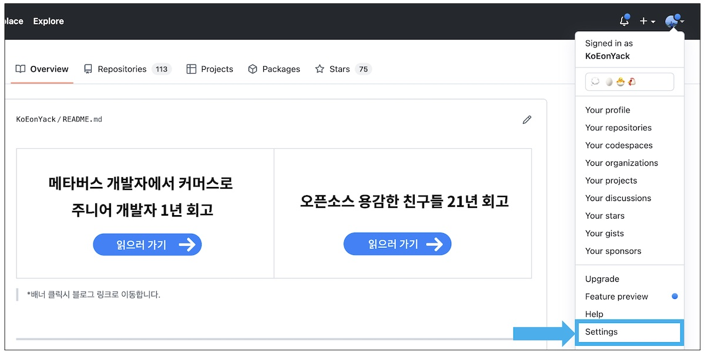
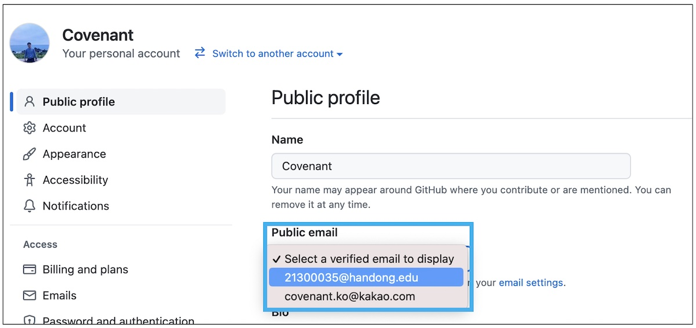

# Github 소셜 로그인이 안될때

Github 로그인에 실패했을때 다음과 같이 진행해주세요.

## Step1

> 우측 상단의 프로필 이미지 클릭 -> Setting 클릭합니다.

 

## Step2

> Select a verified email to display에서 본인의 이메일을 선택합니다.
> 다시 Dev Event로 돌아가서 Github 로그인을 시도합니다.

 
 
 
 

  

    <h3> 용감한 친구들 with 남송리 삼번지 </h3>
  

